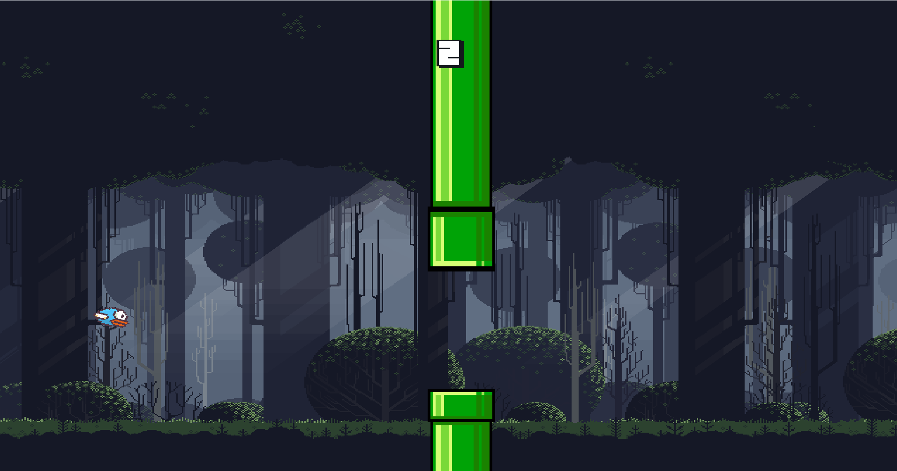
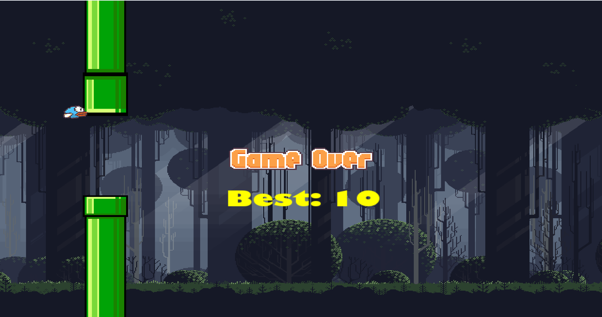

# Flappy-Bird-Clone
# SFML 3.0 Tutorial Project

This is a personal learning project built using **C++** and **SFML 3.0**. 




The goal of this repository is to document my progress in learning game development, specifically mastering the Simple and Fast Multimedia Library (SFML). It contains a basic application setup with a functioning window and event loop, serving as a foundation for more complex features like graphics rendering, user input, and game physics.


## 🚀 Getting Started

### Prerequisites
* **C++ Compiler** (supporting C++17 or later)
* **Visual Studio 2022** (or VS Code with CMake)
* **SFML 3.0.0**

## 💻 Code Overview

This project uses the modern **SFML 3.0** syntax for window management and event polling.

**Main Loop Logic:**
```cpp
while (const auto event = window.pollEvent()) {
    if (event->is<sf::Event::Closed>()) {
        window.close();
    }
}
